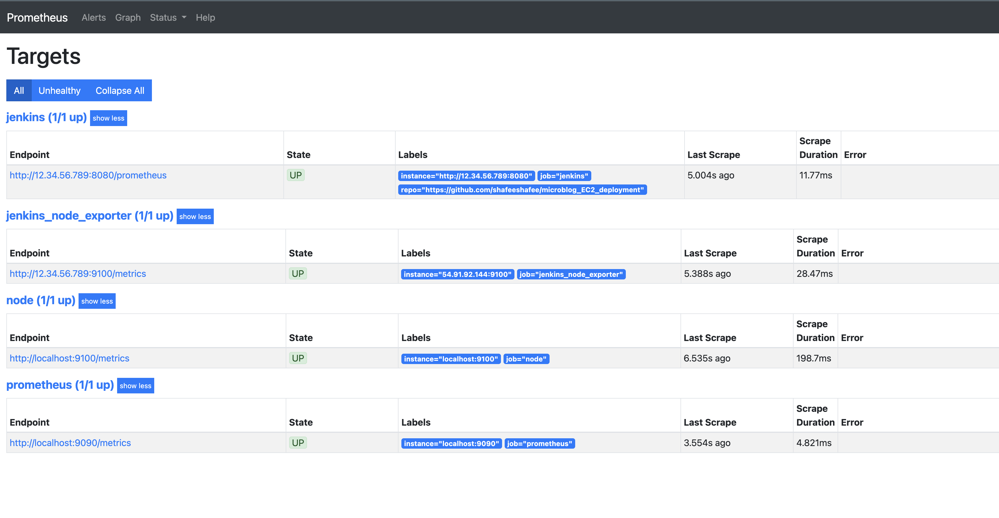

# Microblog EC2 Deployment

## Purpose

The goal of this is workload to deploy a social media application to servers on AWS EC2 instances, all via self provisioning, instead of relying on managed services like AWS Elastic Beanstalk.

It involves setting up a continuous CI/CD pipeline using Jenkins, automating the build, test, running security scans and deployment processes, and implementing monitoring using Prometheus and Grafana to observe application and server resources. And by provisioning our own infrastructure, we get a deeper look into the deployment process, with added ability to customize the environment to our specific needs, as well as get a better understanding of server management and application deployment pipelines.

## Documenting Steps

1. **Set Up Jenkins**

   - Cloned the GitHub repository to our own account and created an Ubuntu EC2 instance named "Jenkins", installing Jenkins using an automated bash script. Cloning the repo provides control over the codebase. Automating Jenkins install ensures consistency and speeds up the setup of the CI/CD orchestrator.

2. **Configured the Server Environment**

   - Installed `python3.9`, `python3.9-venv`, `python3-pip`, and `nginx` by adding the Deadsnakes PPA to the server's package sources. These installations prepare the server with the necessary tools to run the Python application and serve it via Nginx.

3. **Set Up the Application in a Virtual Environment**

   - Cloned the app code onto the server, created a Python venv, activated it, and installed all dependencies, including `gunicorn`, `pymysql`, and `cryptography`. Using a virtual environment isolates the application's dependencies, ensuring consistency and preventing conflicts with system packages.

4. **Configured Application Settings and Database**

   - Set the environment variable `FLASK_APP=microblog.py`, ran `flask translate compile` to prepare translations, and executed `flask db upgrade` to set up the database schema. These helped configure the application for deployment, ensuring language support and database migrations are up to date.

5. **Configured Nginx as a Reverse Proxy**

   - Edited the Nginx configuration to proxy requests from port 80 to the application running on port 5000. Why Nginx? Nginx handles client HTTP requests, improves security, and efficiently serves the application by forwarding requests to the Gunicorn server.

6. **Tested the App Manually**

   - Started the application using `gunicorn -b :5000 -w 4 microblog:app` and accessed it on the browser to confirm it's running. Making sure the application runs correctly in a manual setup ensures the environment is properly configured before automating the deployment.

---

**Note:** Were the above steps involving setting up the Python virtual environment, installing dependencies, configuring environment variables, preparing the application for deployment, configuring Nginx, and launching with Gunicorn absolutely necessary for the CI/CD pipeline?

**Short answer**: _no._

**Long answer**: while these steps were useful for initially configuring and testing the application manually, they're not really necessary to do so when using a CI/CD pipeline. Instead, the real idea of these steps is that we can test these are running locally before it can be run before automating it within the pipeline's build and deploy stages to ensure consistency and repeatability. Automating these processes reduces the potential for manual errors and aligns with the principles of continuous integration and deployment.

---

7. **Automated the Pipeline with Jenkins**

   - Edited the Jenkinsfile to automate the build, test, and deploy stages, including commands to set up the environment, install dependencies, run tests, and deploy the application. Automating these steps in the CI/CD pipeline ensures consistent deployments and reduces manual errors.

8. **Implemented Unit Testing**

   - Created a unit test script `test_app.py` in the `tests/unit/` directory to test application functionality, and included the test execution in the Jenkins pipeline. Automated testing catches issues early, maintaining code quality and reliability.

9. **OWASP Scanning**

   - Got an OWASP API Key in order to scan my project's dependencies.

   **Below is the summary of the results found in dependency-check-report.xml in my workspace:**

   | File Name     | File Path                                              | SHA-256 Hash (truncated)  | Vulnerability ID                             | Confidence |
   | ------------- | ------------------------------------------------------ | ------------------------- | -------------------------------------------- | ---------- |
   | cli-32.exe    | /var/lib/jenkins/.../setuptools/cli-32.exe             | 32acc1bc543116cbe2cff...  | cpe:2.3:a:cli*project:cli:32:*:_:_:_:_:\_:\* | HIGH       |
   | cli-64.exe    | /var/lib/jenkins/.../setuptools/cli-64.exe             | bbb3de5707629e6a60a0c...  | cpe:2.3:a:cli*project:cli:64:*:_:_:_:_:\_:\* | HIGH       |
   | debugger.js   | /var/lib/jenkins/.../werkzeug/debug/shared/debugger.js | 155041522af3e2429e748...  | None identified                              | N/A        |
   | gui-32.exe    | /var/lib/jenkins/.../setuptools/gui-32.exe             | 85dae1e95d77845f2cb59...  | None identified                              | N/A        |
   | gui-64.exe    | /var/lib/jenkins/.../setuptools/gui-64.exe             | 3471b6140eadc6412277d...  | None identified                              | N/A        |
   | gui-arm64.exe | /var/lib/jenkins/.../setuptools/gui-arm64.exe          | e694f4743405c8b5926ff...  | None identified                              | N/A        |
   | t32.exe       | /var/lib/jenkins/.../pip/\_vendor/distlib/t32.exe      | 6b4195e640a85ac32eb6f...  | None identified                              | N/A        |
   | t64-arm.exe   | /var/lib/jenkins/.../pip/\_vendor/distlib/t64-arm.exe  | ebc4c06b7d95e74e315419... | None identified                              | N/A        |
   | t64.exe       | /var/lib/jenkins/.../pip/\_vendor/distlib/t64.exe      | 81a618f21cb87db9076134... | None identified                              | N/A        |
   | w32.exe       | /var/lib/jenkins/.../pip/\_vendor/distlib/w32.exe      | 47872cc77f8e18cf642f8...  | None identified                              | N/A        |
   | w64-arm.exe   | /var/lib/jenkins/.../pip/\_vendor/distlib/w64-arm.exe  | c5dc9884a8f458371550e...  | None identified                              | N/A        |
   | w64.exe       | /var/lib/jenkins/.../pip/\_vendor/distlib/w64.exe      | 7a319ffaba23a017d7b1e...  | None identified                              | N/A        |

10. **Set Up Continuous Deployment and Service Management**

    - Created a `systemd` service for the application to manage it as a background process, modified the Jenkins deploy stage to restart the service, and adjusted permissions to allow Jenkins to manage the service without requiring a password. Managing the application as a service ensures it runs continuously and restarts automatically, while automation in the pipeline enhances efficiency.

    With this step we can finally see our website running on successful Jenkins build updates.

    

11. **Implemented Monitoring with Prometheus and Grafana**

    - Set up a new EC2 instance named "Monitoring", installed Prometheus and Grafana, configured them to collect metrics from the Jenkins server and application, and set up dashboards for visualization. Monitoring provides insights into application performance and server health, allowing for proactive issue detection and resource management.

    ### Endpoint targets we're scraping with Prometheus

    

    ### Example visualization with Grafana pulling from Prometheus

    
    

---

## Issues/Troubleshooting

1. **Installing Python 3.9**

   - Issue: Unable to locate package `python3.9` in the default Ubuntu repositories.
   - Fix: Added the Deadsnakes PPA to access Python 3.9 packages.

2. **Jenkins Slowness**

   - Issue: Jenkins was slow due to IP configuration issues.
   - Fix: Updated the Jenkins configuration file (`/var/lib/jenkins/jenkins.model.JenkinsLocationConfiguration.xml`) with the latest server IP and restarted Jenkins.

3. **Dependency-Check Plugin Delay**

   - Issue: The OWASP Dependency-Check plugin took excessive time due to a missing NVD API key.
   - Fix: Temporarily commented out the OWASP scan in the Jenkinsfile to allow the pipeline to proceed. Noted the need to obtain an NVD API key to speed up future scans.

4. **Jenkinsfile Errors**

   - Issue: Encountered errors in the Jenkinsfile, such as incorrect commands and path issues.
   - Fix: Corrected syntax errors, ensured the virtual environment was activated in each stage, and adjusted file paths.

5. **ModuleNotFoundError During Testing:**

   - Issue: Tests fail with `ModuleNotFoundError: No module named 'microblog'`.
   - Fix: Set the `PYTHONPATH` environment variable to the project's root directory to ensure Python can locate the modules.

6. **Gunicorn Worker Count**

   - Issue: The t3.micro instance couldn't handle 4 Gunicorn workers, causing high CPU usage and freezing.
   - Fix: Switched to a t3.medium.

7. **OWASP Dependency-Check Plugin Slowness:**

   - Issue: The OWASP scan takes a very long time or causes the instance to crash due to resource constraints and API rate limiting.
   - Fix: Obtain an NVD API key to reduce rate limiting issues and consider increasing the EC2 instance size to handle the resource demands.

8. **Reassessing the Clean Stage:**

   - Issue: The Clean stage in our Jenkinsfile attempts to kill Gunicorn processes but fails due to permission issues.
   - Fix: Recognize that managing Gunicorn via `systemd` negates the need for this stage (read issue #9), and consider removing or modifying it accordingly.

9. **Background Processes Terminating**

   - Issue: The application process terminated when the pipeline completed.
   - Fix: Created a `systemd` service to manage the Gunicorn process, ensuring it runs continuously in the background.

10. **IP Address Changes**

    - Issue: EC2 instance IP addresses changed after stopping and starting, causing connection issues.
    - Fix: Reconfigured applications with the new IP addresses. Recognized that using Elastic IPs could prevent this issue, but didn't do so for this workload.

11. **Monitoring Setup Challenges**
    - Issue: Difficulty setting up Prometheus to scrape metrics from the Jenkins server.
    - Fix: Installed `Node Exporter` on the Jenkins server, adjusted security group settings, and updated Prometheus configuration to include the Jenkins server as a target.

## Optimization

### The Power of Provisioning It Ourselves

Provisioning our own infrastructure instead of relying on managed services like AWS Elastic Beanstalk offers several key benefits:

- Self-provisioning grants complete control over every aspect of the infrastructure. This allows for tailored configurations to meet specific application needs, such as choosing exact instance types, customizing network settings, and installing required software without the limitations imposed by managed services.

- By managing resources directly, we have the potential to optimize costs. We pay only for the resources we use and can fine-tune our infrastructure to prevent over provisioning, which is sometimes unavoidable with managed services.

- Building and managing the infrastructure ourselves, although cumbersome at some points, helps us understand the patterns around underlying components like server setup, networking, security configurations, and deployment pipelines, which is essential for tackling more complex projects in the future.

### Is This a "Good System"?

Assessing the quality of this system involves weighing its strengths against its weaknesses:

**Strengths:**

- The system effectively deploys the application using a CI/CD pipeline with Jenkins, incorporates automated testing, and sets up monitoring with Prometheus and Grafana.
- The process offers a comprehensive learning experience in setting up and managing infrastructure manually, deepening our understanding of deployment processes and tools.

**Weaknesses:**

- Manual server provisioning and configuration introduce complexities and are time-consuming. This approach increases the risk of human error and makes scaling difficult.
- The current setup lacks mechanisms for automatic scaling to handle variable workloads, which could lead to performance issues under high traffic.
- Without robust security measures, manually managed infrastructure can be vulnerable to misconfigurations and unauthorized access.
- Resource contention! Hosting both Jenkins and the application on the same EC2 instance can lead to resource contention, affecting the performance and reliability of both services.

So while the system serves its purpose and provides valuable hands-on experience, it falls short of being a "good system" in a production context. It lacks scalability, well-rounded security, and efficient resource management, which are good traits of a production-grade environment.

### Optimizations / Future Deployments

1. Implement Infrastructure as Code (IaC):
   - Use tools like **Terraform** or **AWS CloudFormation** to automate and manage the infrastructure.
   - Why? IaC promotes consistency across environments, reduces manual errors, and allows for version control of infrastructure configurations. It makes scaling and replicating environments more straightforward.
2. Separate Jenkins and Application Servers:
   - Deploy Jenkins and the application on separate EC2 instances. This separation prevents resource contention, ensuring that CI/CD processes do not impact application performance. It enhances reliability and allows each service to scale independently.
3. Utilize Elastic IPs:
   - Assign Elastic IPs to EC2 instances to maintain consistent public IP addresses. This prevents connectivity issues caused by IP address changes when instances are stopped and started, improving reliability and simplifying configuration.
4. Set Up a Custom Virtual Private Cloud (VPC):
   - Create a custom VPC with public and private subnets, security groups, and network access control lists (ACLs).
   - Why? A custom VPC offers enhanced security and network control. It allows for the isolation of resources, better traffic management, and adherence to best practices in network architecture.
5. Implement Auto Scaling and Load Balancing:
   - Use Auto Scaling Groups and Elastic Load Balancers to manage application instances. Auto scaling adjusts the number of running instances based on demand, providing high availability and optimal performance. Load balancing distributes incoming traffic evenly, preventing any single instance from becoming a bottle neck.
6. Enhance Security Measures:
   - Apply robust security practices, including:
     - Configuring IAM roles with the principle of least privilege.
     - Tightening security group rules to allow only necessary traffic.
     - Regularly updating and patching servers.
     - Enforcing encryption for data at rest and in-transit.
     - Implementing Multi-Factor Authentication (MFA) for critical operations.
7. Containerization and Orchestration:
   - Containerize the application using Docker and manage it with orchestration tools like Kubernetes.
8. Automate Deployment Processes:
   - Use CI/CD tools to automate the entire deployment pipeline, including testing, security scans, and deployment to production.
   - Why? Automation reduces manual intervention, minimizes errors, and optimizes the deployment cycle, allowing for more frequent and reliable releases.

## Conclusion

This workload provided practical experience in deploying a web application on self-provisioned EC2 instances, setting up a CI/CD pipeline with Jenkins, and implementing monitoring solutions with Prometheus and Grafana. It showcases the intricacies and considerations of managing infratructure independently, emphasizing the importance of automation, monitoring, etc. While provisioning our own resources offers more flexibility, it also requires more diligent management to make sure reliability, security, and scalability are considered.
